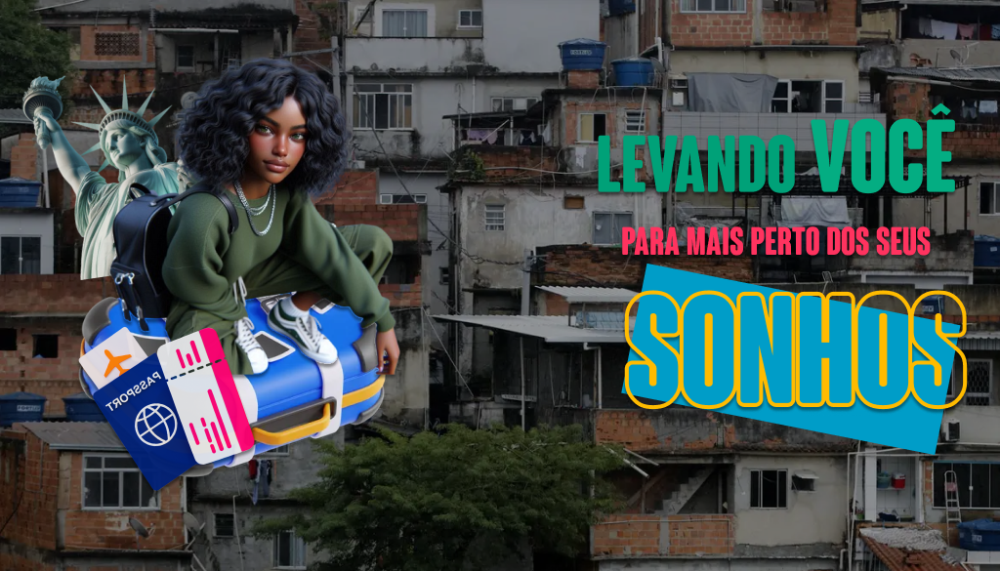

# 🌍✨ LevaNois ✈️💼  

  

---

## 📖 Sobre nós

**LevaNois** é uma plataforma feita para **conectar jovens de comunidades periféricas a oportunidades de intercâmbio internacional** e viagens culturais.  
Nosso objetivo é **romper barreiras socioeconômicas**, incentivando o aprendizado, a organização financeira e a inclusão cultural.  

🎯 **Missão:** Tornar o sonho de explorar o mundo acessível para todos.  
🌟 **Visão:** Ser a principal referência em planejamento de intercâmbio para jovens da periferia.  
💡 **Valores:** Inclusão, empoderamento e sustentabilidade.  

---

## 👩‍💻 Nossa equipe

Contamos com um time dedicado e apaixonado que uniu habilidades para criar o LevaNois:  

- 👨‍💼 [Felipe Dias](https://www.linkedin.com/in/felipediaslima/): Product Owner (PO) e Desenvolvedor Back-end
- 🧑‍⚖️ [Luiza Ramalho](https://www.linkedin.com/in/luiza-souza-ramalho/): Scrum Master e Desenvolvedora Full Stack
- 🤝 [Lessandro](https://github.com/sleeap): Designer e Desenvolvedor Front-end  
- 📝 [Wesley da Silva](https://www.linkedin.com/in/wesley-da-silva-rocha-a12201222/): Financeiro, Social Media e Banco de Dados
- 🛠️ [Heitor Chagas](https://www.linkedin.com/in/heitor-chagas-feitosa/): Financeiro e Desenvolvedor Full Stack 
- 🎮 [Gustavo Faustino](https://www.linkedin.com/in/gustavogfoliveira/): Desenvolvedor Full Stack
- 🎨 [Emilly Lourenço](https://www.linkedin.com/in/emillylouren%C3%A7o/): UX/UI Designer e Desenvolvedora Front-end

---

## 🚀 Tecnologias utilizadas

Para proporcionar uma experiência única e inclusiva, utilizamos as melhores ferramentas:

- ⚛️ **React.js**: Desenvolvimento da interface.  
- 🎨 **CSS**: Estilização e design moderno.  
- 🛠️ **Figma**: Criação de protótipos e identidade visual.  
- 🤟 **VLibras**: Acessibilidade para surdos.  
- 🌐 **Netlify**: Hospedagem da plataforma - [LevaNois](https://levanois.netlify.app).  

---

## 🔗 Redes sociais e ferramentas do projeto

Conecte-se com o LevaNois e com o time para saber mais:  

- 📸 [Instagram](https://www.instagram.com/leva.nois/)  
- 💼 [LinkedIn](https://www.linkedin.com/company/leva-nois/)  
- 💬 **Discord**  
- 📋 **Trello** 

---

## 🎯 Próximos passos

Nosso foco para o futuro:

- 🌍 Adicionar mais destinos culturais e linguísticos.  
- 🧑‍🏫 Criar um sistema de mentoria para guiar os jovens.  
- 🤖 Usar inteligência artificial para personalizar planejamento financeiro.  
- ♿ Expandir ferramentas de acessibilidade e inclusão.  

---

## 💜 Agradecimentos especiais

Este projeto foi possível graças ao apoio e incentivo de muitas pessoas e organizações incríveis:  

- 👩‍🏫 **Gabriel, Júlio, Débora e Aurora**: Professores inspiradores do **PROA** que nos guiaram durante toda a jornada.  
- 🌟 **Liliane**: Nossa mentora, que sempre acreditou no nosso potencial.  
- 🕊️ **Rô**: Em sua memória, continuamos movidos por sua força e legado.  
- 🎓 **PROA**: Instituição que proporcionou a base para que o LevaNois fosse criado, oferecendo conhecimento, estrutura e motivação para crescermos juntos.  

Agradecemos também às comunidades e parceiros que acreditam no potencial transformador do LevaNois.  

---

  ✨ **LevaNois - Levando você para mais perto dos seus sonhos.** ✨  

